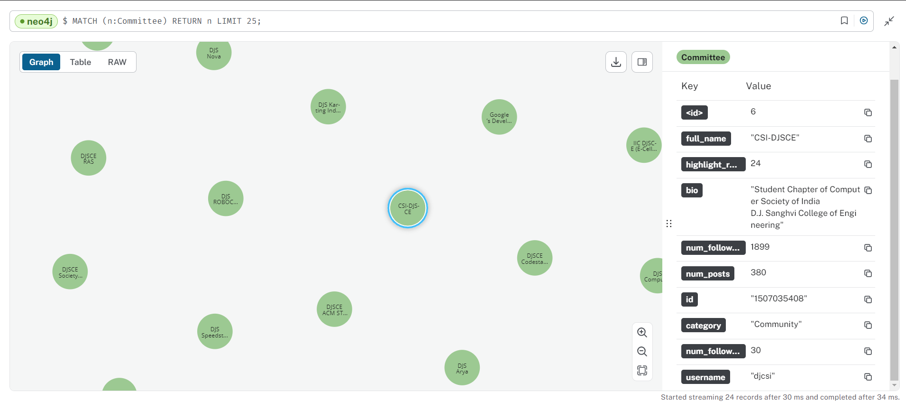
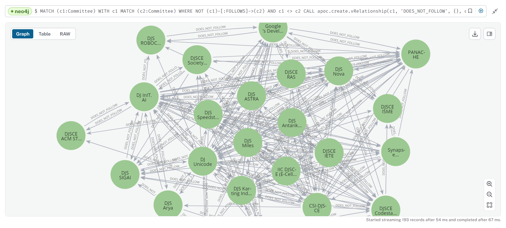
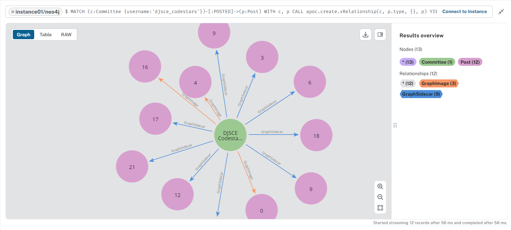
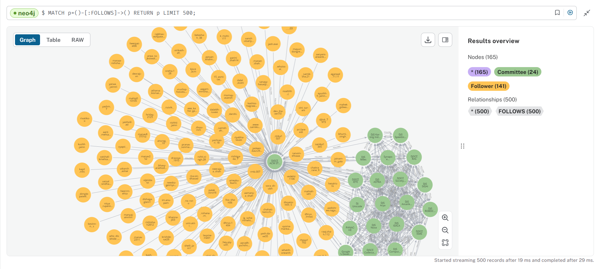
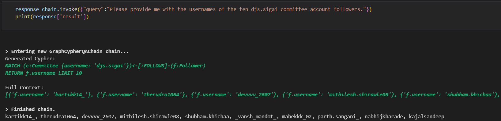
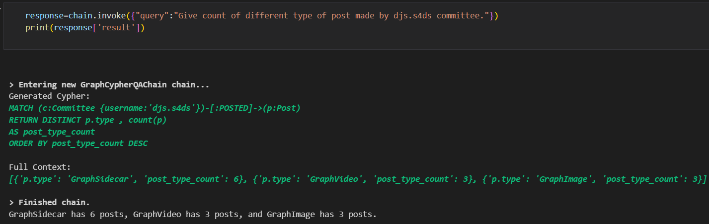

This project is a fun experiment where I scraped the Instagram accounts of my college committees, stored the data in a Neo4j graph database, and visualized the relationships between committees, posts, and followers. Additionally, I used LangChain to create a conversational chatbot that can chat with the graph data, enabling natural language queries on the stored information.

### Graph Schema
- **Nodes:**
1. Committee: Represents a college committee account, where each account had properties such as, id, username, bio, num_followers, num_posts, category, num_following, etc.
2. Follower: Represent an instagram account that is not a college committee account. 
3. Post: Represents a post made by a committee account. Properties: id, caption, comments, type (GraphSideCar, GraphVideo, GraphImage), time_taken, likes, views.

- **Relationships**
1. (:Committee)-[:POSTED]->(:Post): A committee posts a specific post.
2. (:Committee)-[:FOLLOWS]->(:Committee): A committee follows another committee.
3. (:Follower)-[:FOLLOWS]->(:Committee): A follower follows a committee.

### Visualization:
1. **Committees**: Had total of 24 committee account in graph database.

2. **Non following Committees**: Visualization of committee accounts that don't follow each other. (data was collected on 18 August 2024, it mighted have changed after that)

3. **Posts made by committees**: The data collected had only 12 most recent post made by a committee accounts, I did not scrape all the post made.

4. **Followers**: Each committee had around 800-900 followers on average, so there are more that 22K nodes in the database.

#### Chatbot
Using `GraphCypherQAChain` from langchain along with `Gemma2` LLM, we can chat with the database. The LLM generates cypher queries to retrive node, relationships or subgraphs from the databse, which acts as context or semantic information for the LLM. This relies on the LLM to provide a correct cypher query. It functions well for simple queries but requires two to three tries for more complicated ones.

